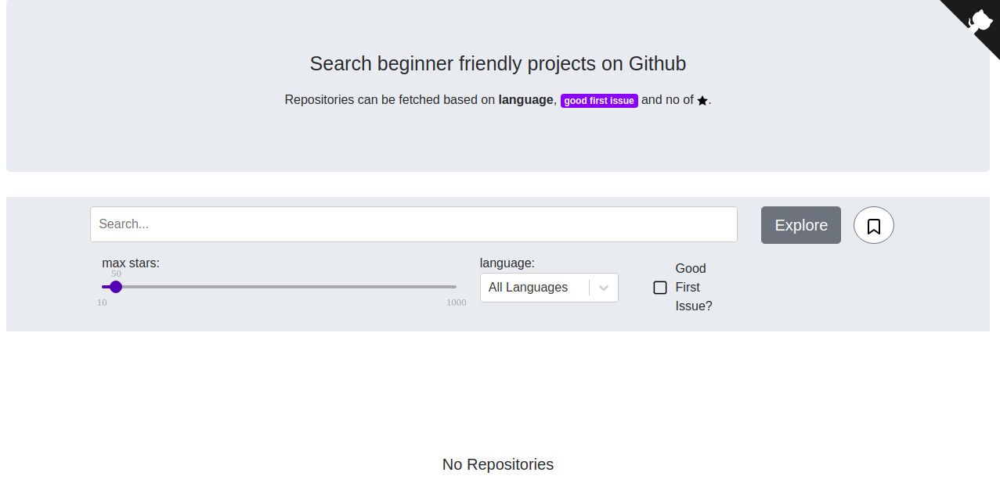
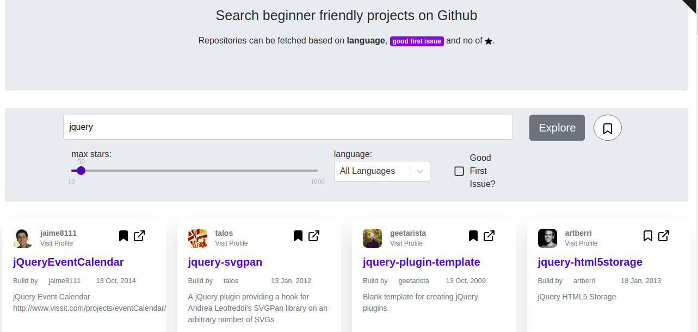
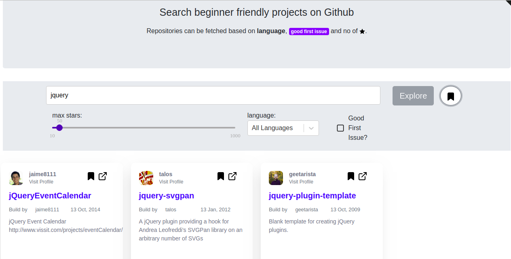

<h1 align="center">
  	   GitFirst
</h1>

   
  
  

  <b>Search repositories on GitHub for contribution</b> 

   <b>GitFirst</b> is a react application that lets you explore projects on GitHub and filter based on <b>language</b>,<b>stars</b> and <b>good first issue</b> label.
  <a href="https://git-first.netlify.com/">Visit Site</a>

  
  <b>Initial View</b> 
  💥 Search by text, no of stars, lanuage and "good first issue" label 💥

  
  <b>Bookmark Projects</b> 
  💥 Click on the <b>bookmark</b> icon to bookmark project and view later 💥

  
  <b>View Bookmark Projects</b> 
  💥 Click on the <b>bookmark</b> icon next to <b>Explore</b> button to view bookmarked projects. 💥

## How to run project
* Clone repo with `git clone https://github.com/manishsaraan/git-first.git`
* Install dependencies with `yarn install`
* Run project with `yarn start`

Visit: http://localhost:3000 to view the project

